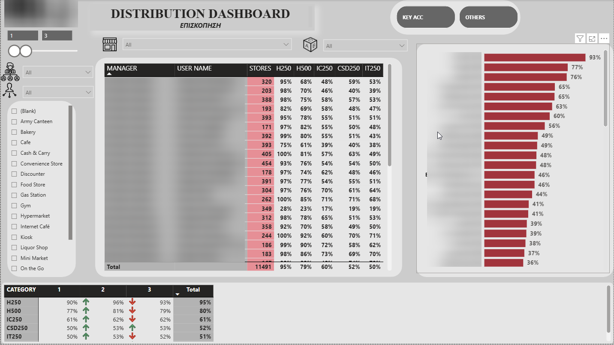
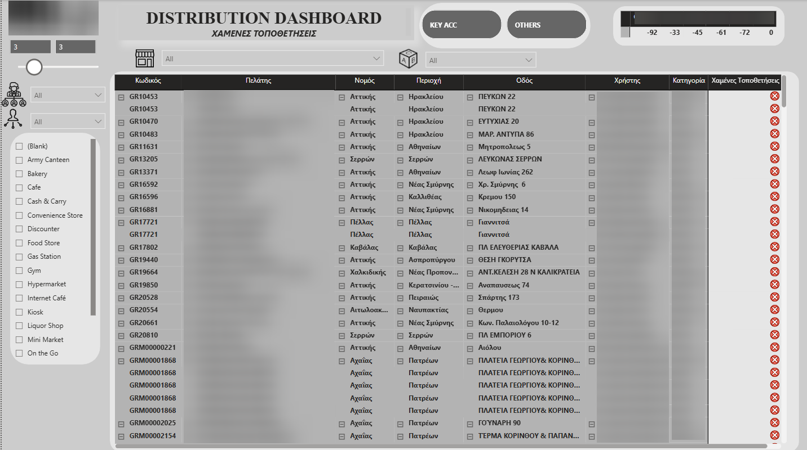
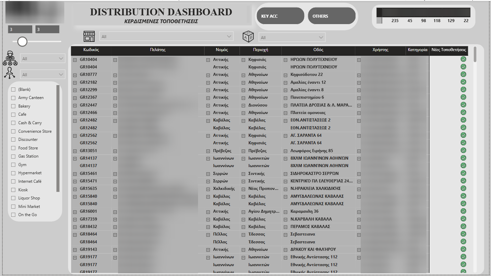

**FMCG Retail Distribution & Placement Tracker**

An enterprise-grade Power BI audit tool designed for FMCG commercial teams to monitor, analyze, and optimize Numeric Distribution across retail networks. This interactive dashboard tracks product availability, identifies distribution gaps, and provides field sales representatives with direct, actionable lists of lost and won shelf placements to maximize market penetration.

🔒 **Data Confidentiality & Anonymization Disclaimer**

Important Note for Recruiters & Viewers:

This portfolio project is built using real retail sales and audit data. To comply with strict Non-Disclosure Agreements (NDAs) and protect corporate proprietary information, all brand names, manager identities, store names, and exact geographic coordinates have been strictly blurred or anonymized.

📊 **Dashboard Structure & Field Applications**

1. **Sales Force & Territory Overview** 

This tab serves as the high-level control tower for commercial directors and regional managers. It aggregates distribution health across sales managers and product categories.

Manager Performance Matrix: Tracks the number of active stores per sales rep alongside the exact distribution percentage ($Distr\%$) for key SKU segments: $H250$, $H500$, $IC250$, $CSD250$, and $IT250$.

Category Trend Analysis: A dynamic breakdown showing performance changes ($\Delta\%$) across distinct measurement periods (Periods 1, 2, and 3) to spot distribution drops or growth momentum instantly.

Granular Filters: Slicers by geographical region (e.g., GR/Greece), customer tier (Key Accounts vs. Traditional Trade/Others), and store channel (Bakery, Gas Station, Kiosk, etc.) allow for instant root-cause analysis.

2. **Customer Audit & Shelf Availability**

A highly tactical sheet designed for field supervisors to audit individual stores, cooler presence, and precise product lineups.

Point of Sale (POS) Audit Grid: Lists exact retail outlets (with unique Code, Prefecture, Region, and Street) indicating the active presence ($\checkmark$) or out-of-stock/missing status ($\times$) for each SKU on the shelf.

Cooler Assets Tracking: Integrated filters allow supervisors to toggle between outlets "With Cooler" or "No Cooler" to measure the sales impact of branded cooling assets.

Distribution Pipeline Matrix: Bottom-table aggregates total gained points in distribution per product category across audit cycles.

3. **Lost Placements Tracker**

This tab functions as a direct "Call to Action" list for field sales representatives to reclaim lost market share.

Loss Identification Engine: Instantly filters and flags outlets where a previously active product category was lost or delisted (visualized with a distinct red indicator $\times$).

Route Optimization: Sales reps can filter by local prefecture (e.g., Attica, Serres, Achaia) and channel type to plan urgent physical store visits to renegotiate and restore lost shelf placements.

Actionable Metadata: Provides exact address info and the assigned sales agent to ensure ownership and clear accountability.

4. **New Placements Tracker**

Tracks the commercial success and execution speed of new product launches and distribution expansion campaigns.

Expansion Win Audit: Displays newly captured retail placements (marked with a green success indicator $\checkmark$) to validate field team execution and incentive achievements.

Launch Velocity Metrics: Shows how fast new SKUs are gaining traction across target channels (e.g., Traditional Trade vs. Key Accounts) using performance threshold cards.

**Tech Stack & Data Modeling Capabilities**

Power BI Desktop: Custom dark-and-gray theme optimized for executive presentation and field mobility.

Advanced DAX Formulation: Evaluates complex conditional logic to dynamically switch between active, lost, and won statuses based on audit dates.

Data Cleansing & Modeling (Power Query): Structured star-schema layout linking flat store audit logs to product, calendar, and sales team dimensions.
